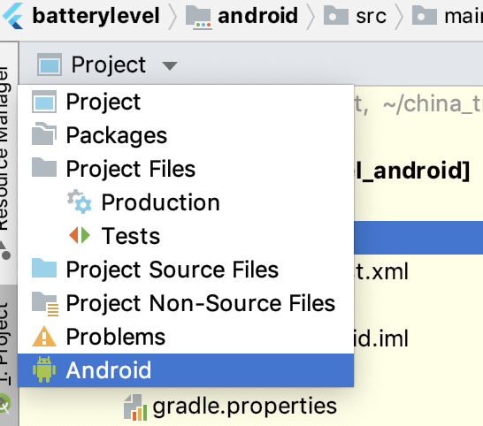

# Flutter Package 
## 目录
### [1.Flutter依赖包的简介](#Flutter依赖包的简介)
### [2.Dart Package开发](#DartPackage开发)
### [3.Flutter Plugin简介](#FlutterPlugin简介)
### [4.Flutter插件开发](#Flutter插件开发)
### [4.1 第一阶段:创建FlutterPlugin工程](#第一阶段_创建FlutterPlugin工程)
### [4.2 第二阶段:编写android端代码](#第二阶段_编写android端代码)
### [4.3 第三阶段:编写Flutter端代码](#第三阶段_编写Flutter端代码)
### [4.4 第4阶段:iOS端代码编写](#第4阶段_iOS端代码编写)
### [5. 插件的三种集成方式](#插件的三种集成方式)
### [6. 怎样将插件发布到pub库](#怎样将插件发布到pub库)
### [7. 参考资料](#参考资料)

## Flutter依赖包的简介
- 它属于一个单独的功能模块,可以同其它语言一样,如C++的dll,iOS使用的framework,android使用的jar包,npm包,等等这些都属于一种外置的依赖包,他们作为一个独立的工程模块可以在多个应用中使用,flutter也是一样,官方也提供了相应的依赖包,需在flutter工程内的`pubspec.yaml`添加相应的依赖包的配置文件引入。

- 从依赖包的结构上划分,Flutter总共有2种外置的依赖包.分别是`dart package`和`plugin package`, 其中`dart package`采用纯dart语言进行开发,他只包含flutter平台的代码。`plugin package`包含了三个平台代码,分别是`flutter`,`Android`,`iOS`,所以下开发插件包之前我们需要具备一些移动端的基础的知识,这里推荐几个传送门。
[awesome-ios](https://github.com/vsouza/awesome-ios)
[iOS官网](https://developer.apple.com/)
[Android-Tips](https://github.com/tangqi92/Android-Tips)
[Android官网](https://developer.android.google.cn/)

- 下面开始本章节的具体内容,先给自己定一个小目标,开发一个简单的`dart package`并集成到Demo中.在做demo之前请确保你的电脑已经安装好了`Flutter`、`Android`、`iOS`开发环境。

## DartPackage开发
- step1: 创建包,可以通过命令创建和使用IDE工具创建。
  - 代码创建方式如下: 
    - `flutter create --template=package [your package name]` 
  - 通过Android Studio工具的图形化命令创建。
    
    
  - 需要注意`包名需使用英文小写`,可以使用`_`分开.如`caculator_package`

- step2: 创建完成后,进入到创建的工程目录中.
  - 可以看到系统生成了如下的目录结构文件
```tree
├── CHANGELOG.md
├── LICENSE
├── README.md
├── caculator_package.iml
├── lib
│   └── caculator_package.dart
├── pubspec.lock
├── pubspec.yaml
└── test
    └── caculator_package_test.dart
```
  - 其中`caculator_package.iml`为IDE创建的模块应用文件,包含了`dart package`的build的相关信息。
  - lib/caculator_package.dart为`dart package`对外暴露的入口文件,在lib文件下新建一个`src`文件夹用于存放我们的开发代码。
  - `pubspec.yaml`用于设置`dart package`的外置依赖,如使用的flutter的sdk版本。
   ```yaml
   name: caculator_package
description: A new Flutter package project.
version: 0.0.1
author:  wuming<wuming@163.com>  # your name<your eamil>
homepage: https://yourpackagerepourl/yourpackagename.git
environment:  #所需要的flutter sdk的版本
  sdk: ">=2.1.0 <3.0.0"
dependencies: #dart package的依赖包。我们可以在下面继续添加其它的依赖包
  flutter:
    sdk: flutter
 # url_launch: 0.0.1 #我们可以在下面继续添加其它的依赖包
dev_dependencies:
  flutter_test:
    sdk: flutter
# For information on the generic Dart part of this file, see the
# following page: https://dart.dev/tools/pub/pubspec
# The following section is specific to Flutter.
flutter:
  # To add assets to your package, add an assets section, like this:
  # assets:
  #  - images/a_dot_burr.jpeg
  #  - images/a_dot_ham.jpeg
  #
  # For details regarding assets in packages, see
  # https://flutter.dev/assets-and-images/#from-packages
  #
  # An image asset can refer to one or more resolution-specific "variants", see
  # https://flutter.dev/assets-and-images/#resolution-aware.
  # To add custom fonts to your package, add a fonts section here,
  # in this "flutter" section. Each entry in this list should have a
  # "family" key with the font family name, and a "fonts" key with a
  # list giving the asset and other descriptors for the font. For
  # example:
  # fonts:
  #   - family: Schyler
  #     fonts:
  #       - asset: fonts/Schyler-Regular.ttf
  #       - asset: fonts/Schyler-Italic.ttf
  #         style: italic
  #   - family: Trajan Pro
  #     fonts:
  #       - asset: fonts/TrajanPro.ttf
  #       - asset: fonts/TrajanPro_Bold.ttf
  #         weight: 700
  #
  # For details regarding fonts in packages, see
  # https://flutter.dev/custom-fonts/#from-packages
   ```
  - `pubspec.lock`文件,用于锁定和解析`pubspec.yaml`的信息,获取当前`dart package`的依赖包。
  ```yaml
# Generated by pub
# See https://dart.dev/tools/pub/glossary#lockfile
packages:
  async:
    dependency: transitive
    description:
      name: async
      url: "https://pub.flutter-io.cn"
    source: hosted
    version: "2.3.0"
  boolean_selector:
    dependency: transitive
    description:
      name: boolean_selector
      url: "https://pub.flutter-io.cn"
  ```
  - `test`为该`dart package`存放测试代码的地方.
  step3: 开始编写`dart package`的具体代码实现
  - 首先在`lib`目录下新建一个`src`文件夹.然后新建一个`caculator.dart`的文件用于写计算相关的代码
  ```dart
part of caculator_package;
/// A Calculator.
class Calculator {
  /// Returns [value] plus 1.
  int addOne(int value) => value + 1;
}
  ```
  
  - 在`lib/caculator_package.dart`文件中使用`library [package name]定义`该`dart package`的名字.
  - 在`lib/src/caculator.dart`文件中`part of [package name]`表示该文件属于package的一部分,
  - 在`src/caculator_package.dart`文件中使用`part 'src/caculator'`将文件与库关联在一起。
  - 这里用到了几个系统的关键字`part of [pacakge name]` 和 `part [source file path]`需配套使用。
  step4: 编写对应测试unit
  - 进入到`test`文件夹中,编写测试代码,以`function`为单位,如果有`case`或者`if else`的分支则需将test case再进行细分.
  step4: 创建一个demo工程用于
  - 这里和创建包类似,同样可以使用`Android Studio`或`flutter command`创建,这里使用命令创建。
  - 终端运行`flutter create --template=app package_demo`,也可以直接使用`flutter create package_demo`创建。
  	```yaml
├── README.md
├── android
├── ios
├── lib
├── package_demo.iml
├── pubspec.lock
├── pubspec.yaml
└── test
  	```
  step5: 这里先介绍通过本地路径引入我们前面开发的`caculator_package`到`package_demo`工程中.
  - 将我们`caculator_package`拷贝到该demo工程的目录下.这里我新建了一个tools文件夹.
  step6: 进入到`pubspec.yaml`文件中,引入该包。
  ```yaml
dependencies:
  flutter:
    sdk: flutter
  # method1: 通过path引入
  caculator_package:    
    path: ./tools/caculator_package
  # method2: 通过git引入
  #caculator_package:    
  #  git: 
  #    url: https://yourgitrepodomain/yourpackagename.git
  #    ref: v0.0.1 #可以是分支名,也可以是tag,默认也可以省略ref
  # method3: 通过pub引入,需要我们将该包发布到pub上
  # caculator_package: ^0.0.1
  ```
  step7: 设置完`pubspec.yaml`之后,需要从新更新工程的依赖包
  - 执行`flutter package get`更新依赖包。
  - 下载完成后依赖包会出现在工程中的`dependency`栏目下.如图,我使用的是VSCode,界面如下:
  
  step8: 到这一步我们就已经把创建的package成功的集成到我们的demo工程中了,下面可以愉快的进行开发了。
  - 在`lib/main.dart`中导入`import 'package:caculator_package/caculator_package.dart';`
  - 使用package定义的function
  ```yaml
class _MyHomePageState extends State<MyHomePage> {
  int _counter = 0;
  Calculator _caculator = Calculator();
  void _incrementCounter() {
    setState(() {
      // This call to setState tells the Flutter framework that something has
      // changed in this State, which causes it to rerun the build method below
      // so that the display can reflect the updated values. If we changed
      // _counter without calling setState(), then the build method would not be
      // called again, and so nothing would appear to happen.
      _counter = _caculator.addOne(_counter);
    });
  }
  ```
  step8: 运行我们的demo工程,点击加号按钮,可以看到数字增加,说明我们的dart包成功运行了。
  - 附上一张效果图:
  

#### 目前项目中使用的package有哪些?
  - 按照功能来划分目前主要有以下几类。
   - genernal
  ```yaml
├── china_features
│   ├── coopers
│   └── discover_feature
├── interceptors
│   ├── common_header_interceptor
│   └── refresh_token_interceptor
├── omc_api_client
├── repositories
│   ├── destination_repository
│   ├── legal_document_repository
│   ├── store_review_repository
│   ├── user_repository
│   ├── vehicle_mapping_repository
│   └── vehicle_repository
├── standard_models
├── storage
│   ├── store_review_storage
│   ├── token_storage
│   ├── user_storage
│   └── vehicle_storage
├── startup_configuration  #配置项目的运行环境
├── connected_ui
├── bloc
├── hydrated_bloc    #缓存bloc的状态信息,用于日志记录,debug调试用。
├── flutter_bloc     
├── json_annotation  #json数据解析
```

## FlutterPlugin简介
- Flutter插件通信,主要是通过 platform channel机制来进行通信的,通过 FlutterEngine将dart侧消息编码封装成不同的 platformMessage传递给相应的平台.平台接受到消息,利用相信的MessageCodec对数据进行编解码,再将新的消息通过FlutterEngine返回给dart端。

- 再开发之前我们需了解一些基本概念,下面是dart端插件对应的api接口类
```tree
├── message_codec.dart. 定了解析的抽象类,定义主要负责消息的解码
├── message_codecs.dart  具体实现类,分别定义了 字符串,二进制,Json以及标准的数据编解码格式
├── platform_channel.dart 定义了各种platform channel,其主要功能是注册bridge事件,用于flutter和native相互调用
├── platform_views.dart。定义来系统view默认的platformChannels和手势点击事件的交互
├── binary_messenger.dart。 将数据进行封装,传递给对应平台的底层接口
```
主要类之间的关如下:

- BasicMessageChannel: 主要用于传递基本的消息类型,它不能显示的指定方法名,数据格式较为单一,不太适合直接使用与复杂的业务逻辑。是用此类时通常需要自己定义对messageCodec,自定义消息格式.
- MethodChannel: 支持方法传递,自带基本的数据类编解码,使用简单。
- OptionalMethodChannel: 和MethodChannel基本一致,native端未实现对应的注册方法时不会抛出异常
- EventChannel: 和MethodChannel类型,不过事件传递是基于广播的方式传递的,他会把方法指针传递到native端,native端实时调用,一般用于持续行的UI事件交互,这样就不用平凡的调用methodInvoke方法。
- MessageCodec及其字类: 数据包装和解析。 其主要是通过传输的二进制中按照规则获取约定的标志位置将数据解析成对应的类型,如下为`StandardMessageCodec`中所定义的数据类型如下,因此他支持了dart所有的基本数据类型解析。
```dart 
  static const int _valueNull = 0;
  static const int _valueTrue = 1;
  static const int _valueFalse = 2;
  static const int _valueInt32 = 3;
  static const int _valueInt64 = 4;
  static const int _valueLargeInt = 5;
  static const int _valueFloat64 = 6;
  static const int _valueString = 7;
  static const int _valueUint8List = 8;
  static const int _valueInt32List = 9;
  static const int _valueInt64List = 10;
  static const int _valueFloat64List = 11;
  static const int _valueList = 12;
  static const int _valueMap = 13;
```
了解上面的几个基本类之后,再看下面的通信过程就比较容易理解了。

 

## Flutter插件开发
- 目前flutter的生态环境不够完善,官方发的插件库无法覆盖我们所有的业务需求,比如`地图`,`支付`,`音视频`,对国内一些大厂的三方`SDK`支持不够友好,所以在实际开发中可能需要自己开发对应的插件.下面以获取设备信息为例,来创建一个简单的插件.主要分为四个阶段, 创建Flutter Plugin工程, 编写`Android`平台的代码,编写`Flutter`平台的代码, `编写iOS`平台的代码.此外我们还需要对自己创建的插件做一些测试和example的补充,并且附上完成的ReadME.md以及Api文档。

### 第一阶段_创建FlutterPlugin工程
- step1: 首先创建插件项目.
  - 这里选择使用代码创建,同样也可以使用`Android Studio`创建,同创建`dart package`类似。
  - `flutter create --template=plugin -i objc -a java batterylevel`,具体参数含义可以在终端通过 flutter help查看,下面是其中几个需要经常用到的参数.
  ```help
-t, --template=<type>          Specify the type of project to create.
          [app]                (default) Generate a Flutter application.
          [package]            Generate a shareable Flutter project containing
                               modular Dart code.
          [plugin]             Generate a shareable Flutter project containing
                               an API in Dart code with a platform-specific
                               implementation for Android, for iOS code, or for
                               both.
-i, --ios-language             [objc, swift (default)]
-a, --android-language         [java, kotlin (default)]
    --[no-]androidx            Generate a project using the AndroidX support
                               libraries
  ```
- step2: 进入到工程目录,首先熟悉各个文件的作用
  ```tree 
├── CHANGELOG.md
├── LICENSE
├── README.md
├── android           #编写插件`android`平台的代码
├── batterylevel.iml. #插件的模块的工程配置信息
├── example           #编写插件`iOS`平台和`android`平台的实例代码,用于做demo展示
├── ios               #编写插件`iOS`平台的代码
├── lib               #编写插件`Flutter`平台的代码
├── pubspec.lock.     #用于锁定yaml文件解析的配置信息,执行pub get时会从此文件去下载对应的依赖包
├── pubspec.yaml      #插件模块的依赖包和资源文件配置信息
└── test              #插件模块的测试代码文件夹
  ```

### 第二阶段_编写android端代码
 - step1: 编写对应的bridge方法实现,在`Android Studio`中打开`batterylevel`插件中,找到下面这个文件夹。
      
   - 在`project`模式下我们无法浏览到`src.main`中的文件,需要切换成`Android`的编辑模式.
      
   - 切换之后可以到如下三个`target`,最上面一个`batterylevel`和我们创建的插件名字一样,他是`flutter target`,然后是`batterylevel_android`是插件对应的`android`端的代码,最后一个是`battery_example_android`他是用于调试此插件的demo工程.
   - 按如图所示,设置`batterylevel_android`和`battery_example_android` target的 sdk版本,这样就不会有编译警告了。
      
   - 首先进入到`BatterylevelPlugin`中,编写`android`端获取设备电量信息的详细代码
```java
     private int getBatteryLevel() {
    int batteryLevel = -1;
    if (VERSION.SDK_INT >= VERSION_CODES.LOLLIPOP) {
      BatteryManager batteryManager = (BatteryManager) applicationContext.getSystemService(applicationContext.BATTERY_SERVICE);
      batteryLevel = batteryManager.getIntProperty(BatteryManager.BATTERY_PROPERTY_CAPACITY);
    } else {
      Intent intent = new ContextWrapper(applicationContext).
              registerReceiver(null, new IntentFilter(Intent.ACTION_BATTERY_CHANGED));
      batteryLevel = (intent.getIntExtra(BatteryManager.EXTRA_LEVEL, -1) * 100) /
              intent.getIntExtra(BatteryManager.EXTRA_SCALE, -1);
    }
    return batteryLevel;
  }
  ```
 - step2: 注册插件
   1. 应用启动后会进入到`MainActivity`的`onCreate`方法中,
   2. 然后开始调用`GeneratedPluginRegistrant`的`registerWith`方法,开始注册插件.这个类是系统自动生成的一个中间类,便于管理.传入参数为当前的`MainActivity`用于和插件做数据交互。
```java
      public class MainActivity extends FlutterActivity {
  @Override
  protected void onCreate(Bundle savedInstanceState) {
    super.onCreate(savedInstanceState);
    //Step1: 全局插件的入口注册(这只是一个抽象类,用于集中管理多个插件的注册),在`anroid`应用的程序入口注册flutter插件.
    GeneratedPluginRegistrant.registerWith(this);
  }
}
```
   3. `GeneratedPluginRegistrant`的主要作用就是为各个插件管理提供一个统一的注册入口, 因为一个项目会有多个插件,为了便于统一管理,系统每次都会生成此中间类。
```java
    public final class GeneratedPluginRegistrant {
  public static void registerWith(PluginRegistry registry) {
    if (alreadyRegisteredWith(registry)) {
      return;
    }
    PluginA.registerWith("xxxxx");
    PluginB.registrarFor("com.example.amap_atlas.AmapAtlasPlugin"));
    .....
  }
```
   4. 接下来进入到我们的其中一个插件`BatterylevelPlugin`,进到插件的具体实现方法中,每个插件中至少需要绑定一个MethodChannel.如果是需要传递视图的插件,还需要注册对应的PlatformViewFactory实例.
   
```java
  public static void registerWith(Registrar registrar) {
      //step1: 注册MethodChannel用于和flutter通信, `registrar.messenger()`为MainActivity中绑定的BannaryMessager,name为对应的渠道标示。
    final MethodChannel battery_channel = new MethodChannel(registrar.messenger(), "batterylevel_channel");
    //保存activity的currentContext实例,用于获取batteryManager
    applicationContext = registrar.context();
      //step2: 绑定battery_channel的回调方法
      battery_channel.setMethodCallHandler(new BatterylevelPlugin());
      //step3: 注册ViewFactory,用于接受来自flutter端的构造视图的指令
    registrar.platformViewRegistry().registerViewFactory("batterylevel_view", new AndroidViewFactory(registrar, registrar.messenger()));
  }
```
   5. 如果需要向Flutter端传递视图,则需要额外的注入`PlatformViewFactory`实例到`registrar`中,这样flutter端在根据对应的`ViewType`查找到对应的`ViewFactory`构造相应的视图,再通过registrar.messenger()传递到flutter端。每个`PlatformViewFactory`必须要实现 MessageCodec和PlatformView构建方法。
   ```java
    super(StandardMessageCodec.INSTANCE);
        this._registrar = registrar;
        this._binaryMessenger = binaryMessenger;
    }
    @Override
    public PlatformView create(Context context, int i, Object o) {
        return new AndroidViewDemo(i,_binaryMessenger, _registrar,o);
    }
   ```
   6. `PlatformView`中我们可以根据对应的viewid为每个View构建唯一的`MethodChannel`用于数据交互.
   ```java
     public AndroidViewDemo(int viewId,
                       BinaryMessenger messenger,
                       Registrar registrar,
                       Object o) {
        this.binaryMessenger = messenger;
        this.methodChannel = new MethodChannel(binaryMessenger, Constant.PLUGIN_BASIC_NAME + "_" + viewId);
        this.methodChannel.setMethodCallHandler(this);
        this.eventChannel =  new  
        setupViews(registrar);
    }
   ```
   小结: android端插件的注册分3步:
    - 注册该Plugin的`registrar`实例,这一步主要创建了BinaryMessage,用于管理该插件的所有通信。
    - 注册对应的MethodChannel用于平台之间的双向通信
    - 如果需要传递视图则需要单独为每个视图创建对应的`PlatformViewFactory`并注册.
    效果图:
    

### 第三阶段_编写Flutter端代码
   - step1: 安卓端的代码完成后,开始编写Flutter端的代码。也可以先将android和iOS两个平台的代码写完再写flutter端代码.(不推荐,先保证一个平台能运行起来,便于我们提早发现问题)。
   
```yaml
    ├── batterylevel.dart.  //interface文件,用于暴露该插件的所有公开的方法和类
    └── src
    ├── battery_level.dart   //用于获取native端的电量信息
    ├── battery_level_view.dart  //用于获取native端的视图并包裹成一个flutter端的Widget
    └── battery_level_view_controller.dart //用于控制和native端视图的通信 
    // 在./lib文件夹下面先创建我们所需要的三个文件
    //在./lib/batterylevel.dart.最上面一行使用系统提供的关键字library 定义该库的名称,注意这里需要与pubspec.yaml中插件的名字相同.然后通过 part [source file]和 part of [library]关联和库有关的所有文件。他们的使用方式如下:
    //在./lib/src/batterylevel.dart文件中使用  part of batterylevel; 
    //在./lib/batterylevel.dart 中使用 part 'src/battery_level.dart';
```
   - step2: 注册对应的methodChannel和messageCodec指定数据的编解码规则,关于数据编解码一般使用系统默认提供的StandardMessageCodec及可,它可以将基本的数据类型转换为json对象.是一种比较常规的写法.
```dart
    static const MethodChannel _channel =
      const MethodChannel("flutter.io/batterylevel");
       static Future<int> get getBatteryLevel async {
      final int batteryLevel = await _channel.invokeMethod('getBatteryLevel');
    return batteryLevel;
```
  - step3: 注册对应的ViewType构建方法,同时将获取到的View包装成Flutter端的Widget
```dart
    Widget _buildPlatformView(BuildContext context){
      if (Platform.isAndroid) {
        return AndroidView(
          viewType: PLUGIN_PLAT_FORM_BASIC_VIEW_NAME,
          layoutDirection: TextDirection.ltr,
          hitTestBehavior: PlatformViewHitTestBehavior.opaque,
          creationParams: "flutter call native platformViewFactory to create view and resen to flutter",
          onPlatformViewCreated: onPlatformViewCreated ,
          creationParamsCodec: StandardMessageCodec(),
        );
      } else if (Platform.isIOS) {
        return AndroidView(
          viewType: PLUGIN_PLAT_FORM_BASIC_VIEW_NAME,
          layoutDirection: TextDirection.ltr,
          hitTestBehavior: PlatformViewHitTestBehavior.opaque,
          creationParams: "flutter call native platformViewFactory to create view and resen to flutter",
          onPlatformViewCreated: onPlatformViewCreated ,
          creationParamsCodec: StandardMessageCodec(),
        );
      } else {
        return Container();
      }
  }
```
  step4: 在PlatformView创建完成的回调方法中直根据对应的viewId初始化view绑定的Method渠道.为了将视图和业务逻辑分离,通常的做法是新建一个对应的viewController完成methodChannel的创建以及native方法调用的注册。
```dart
    class BatteryLevelViewController {
   StreamController _flutterToEvaluteStream;
   MethodChannel _battery_view_channel; 
   BatteryLevelViewController({@required int viewId, StreamController flutterToEvaluteStream})
   : _battery_view_channel = MethodChannel("flutter.io/batterylevel_view_${viewId}"),
    _flutterToEvaluteStream = flutterToEvaluteStream; 
   Future<void> sendMessageToNatvie(String message) async{
     await _battery_view_channel.invokeMethod('nativeToEvalute', message);
     return Future.value();
   }
   void bindNativeMethodCallBackHandler() {
      _battery_view_channel.setMethodCallHandler(this._handler);
   }
```
   - step5: 到这一步我们的插件对应android平台的代码已经完成,可以在demo中运行看下效果。
    
    小结 
    - 注册MethodChannel
    - 注册View构建的Widget
   
### 第4阶段_iOS端代码编写
 - 整体思路同android写法类似,分为三个步骤
 step1: 注册该Plugin的`registrar`实例,这一步主要创建了BinaryMessage,用于管理该插件的所有通信。在AppDelegate启动时开始注册.
  ```Objective-C 
- (BOOL)application:(UIApplication *)application
    didFinishLaunchingWithOptions:(NSDictionary *)launchOptions {
  [GeneratedPluginRegistrant registerWithRegistry:self];
  // Override point for customization after application launch.
  return [super application:application didFinishLaunchingWithOptions:launchOptions];
}
//然后进入到`GeneratedPluginRegistrant`中,此类为系统自动生成,用于管理所有的插件注册。
+ (void)registerWithRegistry:(NSObject<FlutterPluginRegistry>*)registry {
  [BatterylevelPlugin registerWithRegistrar:[registry registrarForPlugin:@"BatterylevelPlugin"]];
}
  ```
//最后进入到`BatterylevelPlugin`,这歌类才是我们插件的具体实现入口。前面2部分的操作都是为了给插件提供一个`FlutterPluginRegistrar`实例,通过该实例对象就能获取到和插件通信的`BinaryMessenger`。
  step2: 注册对应的MethodChannel用于平台之间的双向通信
  ```Objective-C
+ (void)registerWithRegistrar:(NSObject<FlutterPluginRegistrar>*)registrar {
  FlutterMethodChannel* channel = [FlutterMethodChannel
      methodChannelWithName:@"flutter.io/batterylevel"
            binaryMessenger:[registrar messenger]];
  BatterylevelPlugin* instance = [[BatterylevelPlugin alloc] init];  
    DemoViewFactory* factory = [[DemoViewFactory alloc]initWithRegistrar:registrar];
    [registrar registerViewFactory:factory withId:@"flutter.io/batterylevel_view"];
  [registrar addMethodCallDelegate:instance channel:channel]; 
}
  ```
  step3: 如果需要传递视图则需要单独为每个视图创建对应的`PlatformViewFactory`并注册.
 ```Objective-C
     DemoViewFactory* factory = [[DemoViewFactory alloc]initWithRegistrar:registrar];
    [registrar registerViewFactory:factory withId:@"flutter.io/batterylevel_view"];
 ```
  step4: 实现MethodChannel的注册方法`getPlatformVersion`, `getBatteryLevel`.
  ```Objective-C 
  //除了通过`[registrar addMethodCallDelegate:instance channel:channel];`代理方式设置Flutter的回调,还可以使用MethodChannel的bloc回调设置,后面会提到
  - (void)handleMethodCall:(FlutterMethodCall*)call result:(FlutterResult)result {
  if ([@"getPlatformVersion" isEqualToString:call.method]) {
    result([@"iOS " stringByAppendingString:[[UIDevice currentDevice] systemVersion]]);
  } else if ([@"getBatteryLevel" isEqualToString:call.method]) {
      int batterylevel = (int)[UIDevice currentDevice].batteryLevel;
      result([NSNumber numberWithInt:batterylevel]);
  } else {
    result(FlutterMethodNotImplemented);
  }
}
  ```
  step5: 实现`PlatformViewFactory`的创建方法.并根据生成的viewId为`PlatformView`创建唯一的channel,通过此channel和flutter通信。
  ```OBjective-C
  - (NSObject<FlutterPlatformView>*)createWithFrame:(CGRect)frame
                                   viewIdentifier:(int64_t)viewId
                                        arguments:(id _Nullable)args { ...}
   _channel = [[FlutterMethodChannel alloc]initWithName:channelName binaryMessenger:registrar.messenger codec:[FlutterStandardMethodCodec sharedInstance]];
  [_channel setMethodCallHandler:^(FlutterMethodCall * _Nonnull call, FlutterResult  _Nonnull result) {
            if ([call.method isEqualToString:@"nativeToEvalute"] && weakSelf){
                weakSelf->_view.recieveTextField.text = (NSString*)call.arguments;
            }
        }];
  - (void)clcikSendButton:(UIButton*)btn {
    [_channel invokeMethod:@"flutterToEvalute" arguments:_view.sendTextField.text];
}
  ```
  step6: 注意事项,在使用该插件时，需要在iOS target中的`info.plist`添加视图的支持.
  ```plist
  <key>io.flutter.embedded_views_preview</key>
  <true/>
 ```
   
  小结: Android和iOS的在native端的代码实现基本一致,如下图所示
  

## 插件的三种集成方式
  - 当我们做完 `dart package`或 `dart plugin`之后需要引入到自己的工程中,官方提供了三种方式引入。
  - 通过 git引入,本地路径引入,获取远程 pub库引入。
  

## 怎样将插件发布到pub库
 1. 前置条件: 这里需要使用VPN代理和终端翻墙。实现步骤就不多说了,下面三个网站很多,实际发布时候因各人的本机电脑配置原因会出现各种错误,请参照插件关键步骤.
 2. 实现步骤: 按照官网步骤肯定是发布失败的,国内由于政策原因,被墙隔离。不过可以根据官网步骤去创建插件文档。
Flutter包的官方地址: https://pub.dartlang.org/
Flutter包的国内镜像地址: https://pub.flutter-io.cn
Flutter创建基本步骤,官方教程传送门: https://flutterchina.club/developing-packages/

 3. 发布插件关键步骤
- 检查插件内容是否正确,编译是否成功
flutter packages pub publish --dry-run --server={your pub server}
- 关闭中国区代理
remove local flutter proxy in /.bash_profile
export PUB_HOSTED_URL=https://pub.flutter-io.cn
export FLUTTER_STORAGE_BASE_URL=https://storage.flutter-io.cn
- 设置VPN和终端翻墙,确保`curl www.google.com`能成功
connected VPN
lantern/ShadowsocksX ....
set terminal proxy
export http_proxy & https_proxy
check domains:
curl www.google.com
- 发布packages如果发现地址不对,请手动指定发布服务器.
publish packages
flutter packages pub publish --dry-run --server={your pub server}
注意事项
中国地区的朋友发布时需要将PUB_HOSTED_URL和FLUTTER_STORAGE_BASE_URL注释掉
需提前设置好终端的代理，确保能ping www.google.com或者curl www.google.com成功
发布终端代理时指定发布的服务器为官方服务器[https://pub.dartlang.org], 这一步很关键，如果不指定默认就是https://pub.flutter-io.cn,肯定是推不上去的。

## 参考资料:
[Flutter plugins官方]https://github.com/flutter/plugins
[developing-packages](https://flutterchina.club/developing-packages/#types)
[Flutter Engine]https://github.com/flutter/engine
[Flutter与Native通信 - PlatformChannel源码分析]https://cloud.tencent.com/developer/article/1366113
[深入理解Flutter Platform Channel]https://mp.weixin.qq.com/s/FT7UFbee1AtxmKt3iJgvyg
[awesome-flutter](https://github.com/Solido/awesome-flutter)
